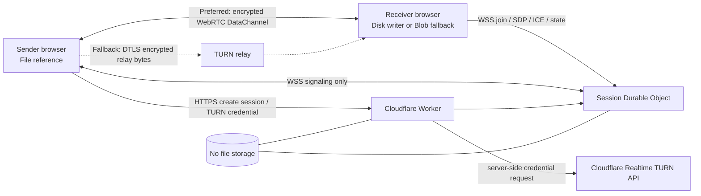
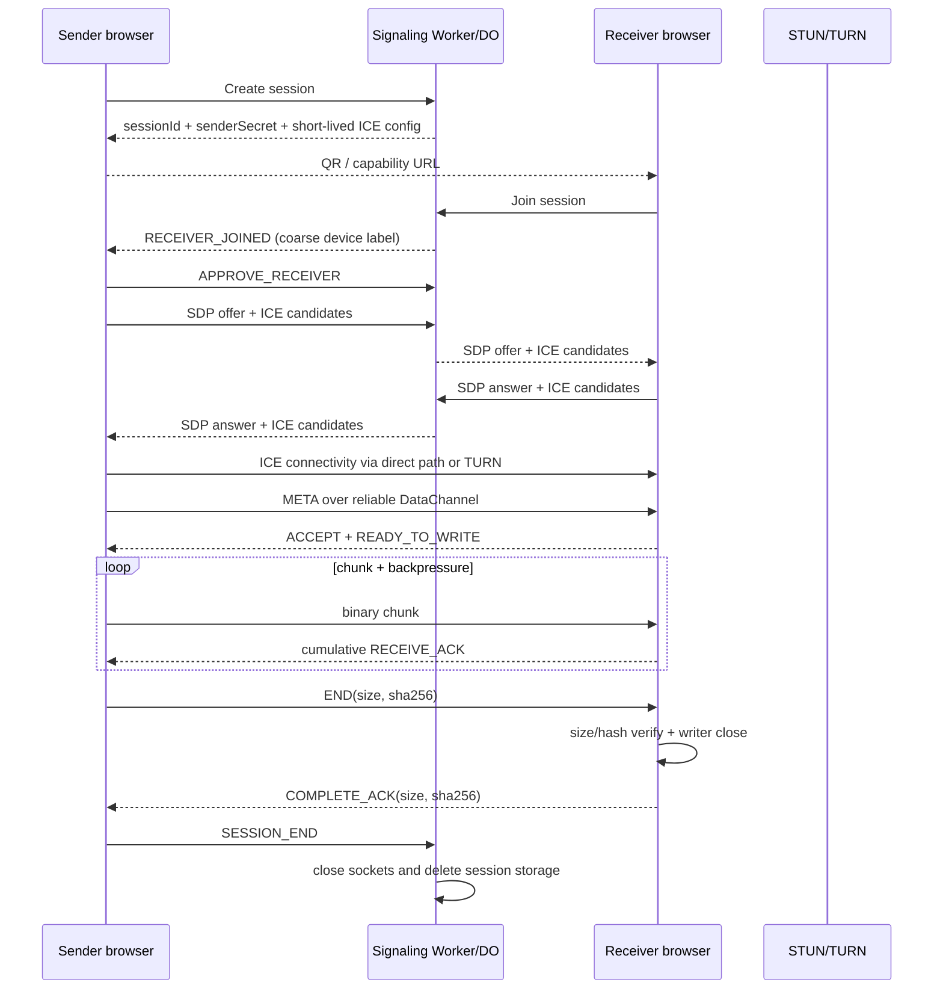
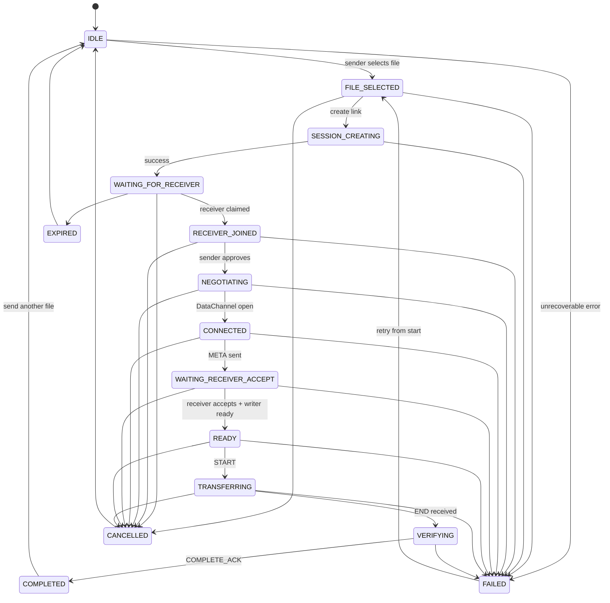

# QR 파일 전송 / Browser P2P File Transfer SPEC

## 문서 상태

- 상태: `SPEC READY · ARCHITECT REVIEWED · IMPLEMENTATION NOT APPROVED`
- 작성일: 2026-09-03
- Product Owner 범위: V1 1:1 실시간 단일 파일 전송
- 송신 도구 URL: `/{locale}/tools/p2p-file-transfer`
- 수신 capability URL: `/{locale}/t/{sessionId}`
- 지원 locale: `ko`, `en`, `ja`
- 기능 평가 PASS: 이 문서의 100점 평가에서 92점 이상
- 공통 평가 PASS: `docs/EVALUATION.md`에서 90점 이상
- 최종 완료: 양쪽 점수, 이슈 게이트 및 모든 필수 QA 게이트를 동시에 충족할 때만 가능
- 구현 금지: 별도 Builder 승인 전 제품 코드, Cloudflare 리소스, DNS 및 배포 설정을 변경하지 않는다.

## 1. 제품 목표

사용자가 파일을 서비스 서버에 미리 업로드하지 않고, QR 코드 또는 링크로 상대방을 초대한 뒤 두 브라우저가 동시에 열린 상태에서 파일을 실시간 전송하도록 한다. 가능하면 WebRTC로 직접 연결하고, 직접 연결이 불가능한 네트워크에서는 암호화된 TURN 중계를 사용한다.

첫 방문자가 5초 안에 다음 사실을 이해해야 한다.

1. 파일은 서비스 서버에 보관되지 않는다.
2. 상대방이 접속해야 전송이 시작된다.
3. 송신 브라우저를 닫으면 받을 수 없다.
4. 송신자와 수신자가 모두 승인해야 실제 파일 전송이 시작된다.

사용자 핵심 문구는 다음으로 고정한다.

> 파일을 서비스 서버에 저장하지 않습니다. 가능하면 브라우저 간 직접 전송하며, 네트워크 환경에 따라 암호화된 TURN 중계를 사용할 수 있습니다.

`서버를 절대 거치지 않음`, `100% P2P`, `무제한`, `링크만 있으면 나중에도 다운로드` 같은 표현은 사용하지 않는다.

## 2. 대상 사용자와 핵심 시나리오

- PC의 영상·문서·압축 파일을 스마트폰으로 옮기는 사용자
- 스마트폰의 사진·영상을 PC로 옮기는 사용자
- 계정이나 클라우드 보관 없이 한 사람에게 즉시 파일을 전달하려는 사용자
- 동일 Wi-Fi뿐 아니라 서로 다른 Wi-Fi 또는 모바일 네트워크에서 전송하려는 사용자

대표 성공 시나리오:

`PC에서 파일 선택 → 공유 링크 생성 → 휴대폰으로 QR 스캔 → 양쪽 승인 → 연결 → 전송 → 수신 크기와 SHA-256 검증 → COMPLETE_ACK → 양쪽 완료`

## 3. 범위와 우선순위

### Must Have

- 단일 파일 선택과 Drag & Drop
- 파일명·정확한 byte 크기·MIME type 표시
- 명시적인 `공유 링크 만들기` 동작
- 추측하기 어려운 세션과 QR·공유 URL
- 기존 QR 엔진 재사용, QR에는 URL만 포함
- 송신자·수신자 1:1 접속 제한
- 송신자 승인과 수신자 승인
- WebRTC DataChannel, ICE, STUN, TURN fallback
- chunk 전송과 `bufferedAmount` backpressure
- 송신 byte·수신 byte를 구분한 진행률
- 이동 평균 속도와 ETA
- 취소·처음부터 다시 전송
- 정확한 파일 크기와 SHA-256 무결성 검증
- 수신 `COMPLETE_ACK` 이후에만 송신 완료 처리
- 세션 만료와 정리
- 연결·전송·검증·실패 상태의 구체적인 사용자 문구
- 전송 중 닫기 경고와 모든 자원 정리
- Full Support 환경의 대용량 디스크 스트리밍
- Limited Support 환경의 명확한 크기 제한과 Blob fallback
- 4단계 작동 방식 illustration, 사용 예시 Mock UI, Privacy 설명, FAQ
- 모바일 송신·수신 UI와 ko/en/ja
- 파일 바이너리·파일명·hash·SDP·ICE 원문을 analytics/log/storage에 기록하지 않음

### Should Have

- Web Share API
- QR 확대 보기
- 연결 방식 `직접 연결` / `중계 연결` 표시
- 위험 확장자 일반 경고
- 실제 네트워크를 쓰지 않는 사용 예시 Demo
- ICE 실패 시 1회의 제어된 ICE restart

Should Have 중 QR 확대와 연결 방식 표시는 V1에 포함한다. Web Share와 위험 확장자 경고는 API 지원 시 포함한다. Demo와 ICE restart는 Must Have 완료 후 예산이 남으면 구현한다.

### Could Have

- 여러 파일, 폴더, 1:N, Pause/Resume, offset resume, 세션 내 기록, PWA

### Do Not Build V1

- 서버 파일 저장, cloud object storage, 오프라인 다운로드
- 계정, 로그인, 보관함, 클라우드 전송 기록
- 1:N 동시 전송, 파일 미리보기 플랫폼
- 클라이언트 IP 또는 과도한 fingerprint 표시
- 링크 비밀번호, 악성코드 검사, 콘텐츠 분석

## 4. V1 UX 흐름

### 4.1 페이지 순서

`Hero → 파일 선택 → 4단계 작동 방식 → 사용 예시 → Privacy/기술 설명 → FAQ`

Hero 제목은 `QR로 바로 파일 보내기`, 부제는 `파일을 서비스 서버에 저장하지 않고 상대방 브라우저로 바로 전송하세요.`를 기본으로 번역한다. `서버 저장 없음`, `QR / 링크 공유`, `브라우저 간 전송` 배지를 제공한다.

### 4.2 송신자

1. 파일 선택 또는 drop. 이때 `File` reference만 보유하며 서버 요청과 전체 파일 read를 하지 않는다.
2. 파일 정보 확인 후 `공유 링크 만들기`를 누른다.
3. QR, 공유 URL, 만료 시각, `이 브라우저를 닫으면 받을 수 없습니다`를 표시한다.
4. 수신자가 접속하면 최소 기기 정보(`Chrome · Android` 수준)와 함께 승인 UI를 표시한다.
5. 송신자가 `전송 허용`을 눌러야 SDP 협상을 시작한다.
6. DataChannel 연결 후 metadata를 수신자에게 보내고 수신 승인을 기다린다.
7. 전송 중 진행률·sent bytes·속도·ETA·연결 방식을 표시한다.
8. 마지막 chunk 전송 뒤 `수신 확인 중`을 표시한다. `COMPLETE_ACK` 수신 전 완료 금지.

### 4.3 수신자

1. 만료·존재 여부를 확인하며 송신자 연결을 기다린다. 파일명은 signaling server가 아니라 연결된 DataChannel metadata로 받는다.
2. 파일명·크기·위험 확장자 안내와 `파일 받기`를 크게 표시한다.
3. Full Support 브라우저는 사용자 클릭 안에서 `showSaveFilePicker()`를 호출해 destination handle을 확보한다.
4. Limited Support 브라우저는 크기 한도를 먼저 표시하고 동의 후 메모리 Blob fallback을 사용한다.
5. 수신 byte·속도·ETA·검증 상태를 표시한다.
6. 파일 크기와 SHA-256이 일치하고 writable close/download 준비가 끝난 뒤 `COMPLETE_ACK`를 전송한다.

### 4.4 CTA와 접근성

- 모바일 수신 화면에서는 파일 정보와 `파일 받기`가 기술 설명보다 먼저 보인다.
- 모든 상태 변화는 눈에 보이는 문구와 `aria-live`로 전달한다.
- progress는 `<progress>` 또는 동등한 semantics와 현재/전체 byte 텍스트를 함께 제공한다.
- QR만으로 공유를 강제하지 않고 항상 복사 가능한 URL을 제공한다.
- QR 확대 dialog는 focus trap, Escape, focus return을 지원한다.
- 파일 drop zone은 keyboard로 file picker를 열 수 있다.

## 5. 작동 방식 illustration

`public/assets/p2p-file-transfer/how-it-works.svg`를 코드 기반 SVG로 직접 제작한다.

- 가로형 16:9, 노트북 → pseudo QR/링크 → 스마트폰 구성
- 스캔 가능한 실제 QR 패턴 금지
- 텍스트는 SVG에 박지 않고 HTML caption으로 제공해 locale·접근성을 지원
- 색상은 CSS custom property 또는 currentColor 계열을 사용해 Dark Mode 대응
- `alt`는 핵심 흐름을 설명하고, 바로 옆에 같은 설명이 있으면 장식 이미지로 처리
- 외부 stock 이미지와 원격 이미지 요청 금지

4단계 caption:

1. 보낼 파일을 선택하세요.
2. QR 코드나 링크를 상대방에게 보내세요.
3. 상대방이 접속하면 브라우저끼리 연결됩니다.
4. 연결된 상태에서 파일을 바로 전송합니다.

## 6. 사용 예시 Mock UI

정적인 `vacation.mp4 · 2.0 GB` 예시로 `선택 → 공유 준비 → 수신 승인 → 68% 전송 → 검증 완료`를 양쪽 기기 화면으로 보여준다. 실제 session, timer, WebRTC, 파일 read를 실행하지 않는다. Mock임을 명시하고 실제 CTA와 시각적으로 구분한다.

## 7. 시스템 경계

### 7.1 배포 구성

- 기존 UI·SEO·수신 route: Next.js 16 App Router, Vercel, `www.konly.co.kr`
- signaling API/WebSocket: 별도 Cloudflare Worker + 세션별 Durable Object
- signaling origin 예: `https://signal.konly.co.kr`, WebSocket은 `wss://signal.konly.co.kr/s/{sessionId}`
- NAT traversal: Cloudflare Realtime STUN/TURN
- 파일 저장소: 없음. R2, Vercel Blob, KV, D1 등에 파일 binary를 쓰지 않는다.

Vercel의 WebSocket 지원 문서가 2026년에도 서로 상충하고 연결 pinning·durable routing 조건이 변동 중이므로, V1 핵심 signaling을 Vercel Function 수명에 결합하지 않는다. 세션당 단일 직렬화 지점과 WebSocket hibernation을 제공하는 Durable Object를 선택한다.

### 7.2 Network architecture



Signaling과 TURN을 파일 저장 서버라고 설명하지 않는다. TURN relay에는 전송 중인 암호화 byte가 흐를 수 있으나 저장하지 않는다.

## 8. Signaling architecture

### 8.1 세션 생성

`POST https://signal.konly.co.kr/v1/sessions`

- Origin allowlist: production/staging/local development 명시 목록만 허용
- CSRF 성격의 타 사이트 남용 방지를 위해 Origin 검증
- IP 기반 완만한 rate limit과 전체 abuse budget 적용. 원 IP는 장기 저장하거나 UI에 노출하지 않음
- 응답: `sessionId`, `senderSecret`, `expiresAt`, `senderWebSocketUrl`, `receiverUrl`
- `sessionId`: CSPRNG 128bit 이상, base64url 22자 이상, 순차 ID 금지
- `senderSecret`: 별도 CSPRNG 256bit capability, URL·QR·analytics에 포함 금지
- receiver는 session URL 자체를 bearer capability로 사용하므로 Referrer-Policy `no-referrer`, route `noindex,nofollow,noarchive`
- sessionId를 로그에서 redact하며 query string보다 path segment를 사용한다.

### 8.2 세션 storage와 만료

세션 Durable Object에는 다음만 저장한다.

```ts
type StoredSession = {
  version: 1;
  createdAt: number;
  expiresAt: number;
  status: "WAITING" | "JOINED" | "NEGOTIATING" | "ACTIVE" | "ENDED";
  senderSecretHash: string;
  receiverClaimed: boolean;
};
```

파일명, 크기, MIME, hash, SDP, ICE candidate, IP, UA 원문, 파일 byte는 Durable Object storage에 저장하지 않는다. SDP/ICE는 연결된 WebSocket 사이에서 즉시 전달하고 application log에서 제외한다.

- 대기 세션 TTL: 30분
- 전송 시작 후: 30분 대기 TTL을 해제하고 최대 6시간 hard deadline 적용
- WebSocket heartbeat: 25초 간격, 75초 무응답 종료
- Durable Object alarm으로 만료를 보장하고 종료·취소·만료 시 `deleteAlarm()`과 `deleteAll()` 수행
- Worker 재시작 후에도 최소 세션 상태와 sender 인증은 복원되지만 진행 중 WebSocket 종료 시 UI는 명확한 재연결/처음부터 재시작 상태로 간다.

### 8.3 1:1 접속

- sender 1 socket + receiver 1 socket만 허용
- 첫 receiver가 atomic claim. 두 번째는 `SESSION_OCCUPIED`로 거부
- QR preview bot/link unfurler의 일반 HTTP GET은 receiver claim으로 간주하지 않음
- 실제 WebSocket join과 client nonce 확인 후 claim
- receiver가 승인 전 이탈하면 30초 grace 후 slot 해제. 전송 시작 뒤에는 자동 새 receiver 교체 금지

## 9. TURN/STUN 전략

- STUN: `stun:stun.cloudflare.com:3478`
- TURN: UDP 3478 우선, TCP 3478/80, TLS 5349/443 fallback
- TURN key와 API token은 Cloudflare Worker secret에만 저장한다.
- 세션 생성 시 sender/receiver별 short-lived credential을 server-side에서 발급한다.
- credential TTL: 기본 2시간. 전송이 계속되면 만료 전에 `setConfiguration()`으로 갱신하며 hard deadline 6시간을 넘기지 않는다.
- client bundle에 장기 TURN credential 금지
- `iceTransportPolicy: "all"` 기본. QA 전용 relay 강제 모드에서 `"relay"`로 TURN fallback을 검증
- `getStats()` selected candidate pair의 `candidateType`으로 direct/relay를 판정하되 IP와 candidate 원문은 UI·analytics에 기록하지 않는다.
- 사용자 표시는 `직접 연결` 또는 `중계 연결`만 제공한다.

운영 비용 위험:

- Cloudflare 공식 2026-09 기준 TURN egress는 첫 1,000GB/month free tier 후 약 US$0.05/GB다. 정책·가격은 배포 직전 재확인한다.
- 2GB 파일 1회를 전부 relay하면 과금 대상 egress가 대략 2GB+protocol overhead일 수 있다. 10TB/month relay egress라면 free tier 제외 단순 추정 약 US$450 수준이며 세금·정책 변경·overhead는 별도다.
- 계정 없는 공개 도구는 TURN credential 남용 위험이 있으므로 Origin 검증, session당 2 credentials, TTL, rate limit, 일·월 usage alert, 비정상 custom identifier 차단, 예산 kill switch가 필수다.
- TURN 예산 또는 credential 발급이 중지된 경우 direct 연결은 시도할 수 있으나 `모든 환경에서 연결 가능`이라고 표시하지 않는다.

## 10. Sender/Receiver sequence



## 11. 상태 machine

공통 core state와 role별 substate를 discriminated union으로 구현한다. UI에서 불가능한 상태 조합을 만들지 않는다.



`SENT_LAST_CHUNK`는 완료 상태가 아니다. 송신 UI는 `VERIFYING/WAITING_COMPLETE_ACK`에서 `상대방의 파일 수신을 확인하고 있습니다`를 표시한다.

## 12. DataChannel 설정

- label: `file-v1`
- `ordered: true`
- `maxRetransmits`와 `maxPacketLifeTime`은 설정하지 않아 reliable mode 사용
- `binaryType = "arraybuffer"`
- control과 binary를 하나의 reliable ordered channel에서 frame type으로 구분한다. V1은 다중 channel ordering 문제를 피한다.
- 협상된 `pc.sctp?.maxMessageSize`를 확인한다.
- 기본 chunk payload: 64 KiB. `maxMessageSize`가 더 작으면 header 여유를 제외해 하향 조정. 256 KiB 이상으로 임의 확대 금지
- chunk 크기 변경은 protocol META에 기록하고 양쪽이 합의해야 한다.

MDN은 SDP에 `max-message-size`가 없을 때 64KiB 기본을 설명하며 큰 message가 head-of-line blocking과 브라우저 차이를 유발할 수 있다고 경고한다. 따라서 64KiB를 보수적 기본값으로 선택한다.

## 13. Backpressure

- high watermark: 4 MiB
- `bufferedAmountLowThreshold`: 1 MiB
- `bufferedAmount >= 4 MiB`이면 file read와 `send()`를 중단
- `bufferedamountlow` 또는 abort/close/error 중 먼저 발생한 event까지 대기
- event 재확인 뒤 다음 chunk를 `Blob.slice(start,end).arrayBuffer()`로 읽는다.
- read-ahead는 최대 2 chunks, 송신 메모리 목표는 protocol overhead 제외 8 MiB 이하
- loop마다 AbortSignal, channel.readyState, session state를 확인
- DataChannel close 뒤 `bufferedamountlow`를 기다려 hang하지 않도록 close/error listener와 timeout을 함께 둔다.

## 14. 전송 protocol

모든 control message는 UTF-8 JSON이며 `v:1`, `type`, `transferId`, 증가하는 `seq`를 포함한다. binary frame은 고정 header + payload 구조로 한다. JSON 및 binary decoder는 길이·type·순서·상한을 검증한다.

### 14.1 Control messages

```ts
type ControlMessage =
  | { v: 1; type: "META"; transferId: string; file: SafeFileMetadata; chunkSize: number; totalChunks: number; hash: "sha-256" }
  | { v: 1; type: "ACCEPT"; transferId: string; saveMode: "stream" | "blob" }
  | { v: 1; type: "REJECT"; transferId: string; reason: "user" | "size" | "unsupported" }
  | { v: 1; type: "START"; transferId: string }
  | { v: 1; type: "RECEIVE_ACK"; transferId: string; receivedBytes: number; contiguousChunk: number }
  | { v: 1; type: "END"; transferId: string; size: number; sha256: string }
  | { v: 1; type: "COMPLETE_ACK"; transferId: string; size: number; sha256: string }
  | { v: 1; type: "CANCEL"; transferId: string; reason: string }
  | { v: 1; type: "ERROR"; transferId?: string; code: TransferErrorCode };

type SafeFileMetadata = {
  name: string;
  size: number;
  mimeType: string;
  lastModified?: number;
};
```

`lastModified`는 전송에 필요하지 않으면 보내지 않는다. 정확한 local path는 브라우저에서 읽거나 보내지 않는다.

### 14.2 Binary frame

```text
byte 0       : protocol version (1)
byte 1       : frame type (1 = FILE_CHUNK)
byte 2..17   : 128-bit transferId
byte 18..21  : uint32 chunkIndex, big endian
byte 22..25  : uint32 payloadLength, big endian
byte 26..N   : payload
```

- payloadLength는 negotiated chunk size 이하
- ordered channel이므로 chunkIndex가 예상값과 다르면 즉시 `PROTOCOL_ERROR`
- received byte가 declared size를 초과하면 즉시 abort
- control JSON 최대 16KiB, filename UTF-8 최대 255 bytes, MIME 최대 127 bytes
- unknown version/type, malformed JSON, non-finite/negative size를 거부

### 14.3 완료 ACK

Receiver는 다음을 모두 만족한 뒤에만 `COMPLETE_ACK`를 보낸다.

1. `receivedBytes === META.file.size`
2. `receivedChunks === totalChunks`
3. incremental SHA-256이 END hash와 일치
4. stream mode는 writable `close()` 성공
5. Blob mode는 완성 Blob 크기 확인 및 download object URL 준비

Sender는 ACK의 size/hash/transferId가 자기 값과 정확히 일치할 때만 `COMPLETED`로 간다. ACK timeout 기본 60초, 수신 검증이 진행 중이면 heartbeat로 연장하되 hard deadline을 넘지 않는다.

## 15. SHA-256과 memory 전략

Web Crypto `subtle.digest()`는 streaming을 지원하지 않고 전체 입력을 메모리에 올려야 하므로 대용량 V1 hash에 사용하지 않는다.

Architect 선택:

- `@noble/hashes`의 incremental SHA-256을 전용 Web Worker에서 사용
- 선택 근거: TypeScript, MIT, zero dependency, tree-shakable SHA-256 약 2.8KB gzip 안내, audit 공개, incremental `create().update().digest()` API
- Builder 시작 시 최신 안정 버전을 고정하고 lockfile·`THIRD_PARTY_NOTICES.md`에 기록
- 송신은 각 chunk를 읽을 때 worker hash update 후 transferable ArrayBuffer를 전송 pipeline으로 넘긴다.
- 수신은 disk write 직전 동일 chunk로 hash update한다.
- hash worker queue 역시 2 chunks 이하로 제한한다.
- 파일 전체 ArrayBuffer, 전체 수신 chunks 배열, 전체 사본 2개 생성을 금지한다.

성능 QA에서 JS hash가 전송 throughput을 지속적으로 제한하면 `hash-wasm`을 비교할 수 있으나, 측정 없이 WASM 의존성을 추가하지 않는다.

## 16. Receiver 저장 전략과 파일 크기

### Full Support

Chromium desktop(Chrome/Edge)에서 `showSaveFilePicker()` + `FileSystemWritableFileStream`으로 chunk를 직접 disk에 쓴다. picker는 반드시 수신자 클릭의 transient user activation 안에서 연다.

- V1 soft warning: 2 GiB 이상
- V1 hard application limit: 10 GiB
- 실제 free disk 용량을 신뢰성 있게 선확인할 수 없으므로 write 실패를 구체적으로 처리
- 중간 실패·취소 시 writable abort/close를 시도하고 부분 파일이 남을 수 있음을 알린다.

### Limited Support

Safari, Firefox 및 File System Access 미지원 환경은 Blob fallback이다. 이 방식은 수신 byte를 메모리에 모아야 하므로:

- hard limit: 200 MiB
- 100 MiB 이상에서 memory 경고
- deviceMemory가 없거나 부정확하므로 이를 보안/허용 판단의 유일 기준으로 쓰지 않음
- 한도 초과 파일은 연결 전에 거부하고 Chromium desktop 사용을 안내
- iOS background/tab suspension 때문에 화면을 켜고 브라우저를 전면에 유지하라는 안내

0-byte 파일은 정상 전송한다. START/END/hash(empty SHA-256)/ACK protocol을 그대로 수행한다.

## 17. 공식 브라우저 지원 정책

아래 표는 구현 전 목표이며 실제 기기 QA 결과가 더 낮으면 지원 수준을 낮춘다. `showSaveFilePicker()`는 MDN 기준 Limited availability이므로 Safari/Firefox에 Full Support를 선언하지 않는다.

| 브라우저 | DataChannel | 직접/TURN | 대용량 disk stream | V1 정책 |
|---|---|---|---|---|
| 최신 Chrome Desktop | 목표 지원 | 필수 검증 | File System Access | Full Support |
| 최신 Edge Desktop | 목표 지원 | 필수 검증 | File System Access | Full Support |
| 최신 Chrome Android | 목표 지원 | 필수 검증 | picker 지원 편차 | Limited, 200MiB 기본 |
| 최신 Safari macOS | 목표 지원 | 필수 검증 | `showSaveFilePicker` 비지원 | Limited, 200MiB Blob |
| 최신 Safari iOS | 목표 지원 | 필수 검증 | 비지원·background 제약 | Limited, 200MiB Blob |
| 최신 Firefox Desktop | 목표 지원 | 필수 검증 | `showSaveFilePicker` 비지원 | Limited, 200MiB Blob |

지원 버전은 `최근 2개 stable major`로 정의하되 Builder 시작일과 QA 시점의 실제 버전을 기록한다. HTTPS가 아닌 production origin은 지원하지 않는다. localhost는 개발 예외다.

## 18. 속도·ETA·진행률

- 송신 진행률: `acknowledged received bytes / file size`를 기본 표시하고, 보조로 local queued/sent 상태를 사용할 수 있다.
- 수신 진행률: `written received bytes / file size`
- 속도: 최근 5초 byte sample의 exponential moving average, 1초 이하 순간값 미표시
- ETA: `remainingBytes / smoothedSpeed`; sample 3개 미만 또는 32KiB/s 미만이면 `계산 중…`
- 0-byte는 100%로 완료하되 division-by-zero 금지
- byte format은 IEC(`KiB`, `MiB`, `GiB`)로 통일하고 정확한 bytes를 접근 가능한 보조 텍스트로 제공
- progress update render는 최대 초당 4회로 throttle해 대용량 전송 중 React render 폭증을 방지

## 19. 오류 코드와 복구

다음 오류를 사용자 행동과 연결한다.

| Code | 사용자 문구 방향 | 복구 |
|---|---|---|
| `SESSION_NOT_FOUND` | 존재하지 않는 링크 | 새 링크 요청 |
| `SESSION_EXPIRED` | 공유 링크 만료 | 송신자가 다시 생성 |
| `SESSION_OCCUPIED` | 다른 기기가 이미 연결 | 기존 연결 종료 후 새 세션 |
| `SENDER_OFFLINE` | 보내는 브라우저가 닫힘 | 송신자에게 다시 열도록 요청 |
| `RECEIVER_REJECTED` | 수신자가 거절 | 대기 또는 취소 |
| `ICE_FAILED` | 네트워크 연결 실패 | 네트워크 확인·재시도 |
| `TURN_UNAVAILABLE` | 중계 연결 사용 불가 | 나중에 재시도·다른 네트워크 |
| `FILE_READ_FAILED` | 파일을 읽지 못함 | 파일 재선택 |
| `FILE_TOO_LARGE_FOR_BROWSER` | 현재 브라우저 저장 방식 한도 | Chrome/Edge desktop 안내 |
| `DISK_WRITE_FAILED` | 저장공간 또는 권한 문제 | 공간·권한 확인 후 처음부터 재시도 |
| `HASH_MISMATCH` | 파일 검증 실패 | 파일 사용 금지, 처음부터 재전송 |
| `PEER_DISCONNECTED` | 상대방 연결 종료 | 처음부터 재전송 |
| `PROTOCOL_ERROR` | 안전하게 전송을 중단함 | 새 세션 생성 |

예상 오류를 console error로 남기지 않는다. 내부 원문 예외, SDP, ICE, IP를 사용자나 analytics에 노출하지 않는다.

## 20. 취소·닫기·자원 정리

- `AbortController` 하나가 file read, worker, backpressure wait, hash, writer를 취소
- 가능한 경우 peer에 CANCEL을 보낸 뒤 DataChannel, PeerConnection, signaling socket 순서로 닫음
- worker terminate, event listener 제거, object URL revoke, writable abort/close, timers 제거
- `beforeunload`는 `NEGOTIATING`부터 `VERIFYING`까지만 등록하고 완료/실패/취소 시 제거
- 브라우저 기본 경고 문구는 커스터마이징할 수 없음을 전제로 함
- 새로고침과 뒤로가기는 세션을 이어받지 않으며 `처음부터 다시 전송`한다.

## 21. 파일명과 콘텐츠 보안

- 파일명은 React text rendering만 사용하며 HTML injection 금지
- UI 표시명과 저장 추천명을 분리
- 저장명에서 `/`, `\`, NUL, C0/C1 control, bidi override를 제거 또는 `_`로 치환
- `.`/`..`, 끝의 dot/space, Windows reserved names를 안전한 기본명으로 치환
- UTF-8 255 bytes 초과 시 확장자를 보존하며 축약
- `.exe`, `.msi`, `.bat`, `.cmd`, `.ps1`, `.sh`, `.apk`, `.dmg`, `.pkg`, `.js`, `.jar` 등은 차단하지 않되 `실행 파일 또는 스크립트일 수 있습니다` 경고
- MIME type과 확장자는 신뢰하지 않고 binary로만 전송하며 앱에서 실행·preview하지 않는다.

## 22. Privacy와 analytics

절대 수집·기록하지 않는 값:

- file content, file name, exact size, file hash, local path
- sender/receiver IP, SDP, raw ICE candidate, session capability URL
- 파일 MIME과 위험 확장자 여부

V1은 P2P 기능 analytics를 기본 비활성화한다. 향후 별도 Privacy 승인 후 `transfer_started/completed`, 거친 size bucket, browser family, direct/relay aggregate만 검토할 수 있다. sessionId와 사용자의 파일 정보는 analytics event에 넣지 않는다. signaling access log와 error tracking에서도 path token과 payload를 redact해야 한다.

## 23. SEO와 receiver route

- 송신 도구 page는 indexable 설명, metadata, canonical, hreflang, JSON-LD를 제공
- receiver capability route는 `robots: noindex,nofollow,noarchive`, canonical 없음, sitemap 제외
- `Referrer-Policy: no-referrer`, `Cache-Control: no-store`, 공유 token이 포함된 URL을 제3자 resource URL이나 analytics로 보내지 않음
- Open Graph crawler가 receiver slot을 점유하지 않도록 GET은 정적 안내만 반환
- 검증되지 않은 `무제한`, `100% 직접 연결`, `서버를 절대 거치지 않음` 문구 금지

검색 의도: 파일 전송, PC 휴대폰 파일 보내기, QR 파일 전송, 브라우저 파일 전송, P2P 파일 전송, 서버 저장 없는 파일 공유.

## 24. FAQ 필수 문구

### 파일이 서버에 업로드되나요?

파일을 서비스 서버에 저장하지 않습니다. 상대방이 연결되면 브라우저 간 실시간으로 전송합니다. 네트워크 환경에 따라 TURN 중계 서버를 통해 암호화된 데이터가 전달될 수 있습니다.

### 링크만 보내두고 PC를 꺼도 되나요?

아니요. 파일이 서버에 저장되어 있지 않기 때문에 보내는 브라우저가 열려 있어야 합니다.

### 상대방이 다 받았는지 알 수 있나요?

네. 수신 브라우저가 파일 저장과 크기·SHA-256 검증을 완료했다는 확인을 보낸 뒤 송신 화면도 완료로 표시됩니다.

### 큰 파일도 보낼 수 있나요?

브라우저, 기기 메모리, 저장 방식과 네트워크 환경에 따라 다릅니다. Chrome·Edge desktop의 디스크 스트리밍은 최대 10GiB를 목표로 하며, 메모리 저장 방식은 V1에서 200MiB로 제한합니다.

### 두 사람이 동시에 받을 수 있나요?

V1에서는 한 번에 한 기기만 지원합니다.

### 전송은 암호화되나요?

브라우저 간 WebRTC DataChannel은 DTLS를 사용해 암호화됩니다. 직접 연결이 어려우면 암호화된 데이터가 TURN 중계 서버를 통해 전달될 수 있습니다.

## 25. 폴더와 모듈 구조

```text
app/[locale]/tools/p2p-file-transfer/page.tsx       # indexable sender page
app/[locale]/t/[sessionId]/page.tsx                 # noindex receiver shell
components/tools/p2p-file-transfer/                 # sender/receiver UI, illustration, status
lib/tools/p2p-file-transfer/
  protocol.ts                                       # schemas/guards/frame codec
  state-machine.ts                                  # pure transitions
  peer.ts                                           # RTCPeerConnection adapter
  transfer-sender.ts                                # chunk/backpressure
  transfer-receiver.ts                              # writer/ACK
  metrics.ts                                        # progress/speed/ETA
  filename.ts                                       # sanitization/warnings
  hash-worker.ts                                    # incremental SHA-256
workers/p2p-signaling/                              # separate Cloudflare Worker project
  src/index.ts
  src/session.ts                                    # Durable Object
  wrangler.jsonc
public/assets/p2p-file-transfer/how-it-works.svg
tests/p2p-file-transfer-browser.mjs
```

Worker는 별도 배포 단위지만 같은 repository에서 versioned protocol type과 fixture를 공유한다. frontend가 signaling code를 직접 import해 client bundle에 secret을 포함하지 않도록 package boundary를 둔다.

## 26. 외부 의존성 결정

| 목적 | 선택 | 결정 |
|---|---|---|
| WebRTC | Browser native API | 라이브러리 없이 thin adapter 작성 |
| QR | 기존 `qrcode` 엔진 | 재사용, QR에 session URL만 입력 |
| Incremental SHA-256 | `@noble/hashes` | Builder 때 고정 버전 추가 |
| Signaling | Cloudflare Worker + Durable Object | 세션별 직렬 상태와 hibernating WebSocket |
| TURN | Cloudflare Realtime TURN | short-lived credential, usage budget 필수 |
| Runtime validation | 직접 type guard 우선 | schema가 커지면 경량 검증 라이브러리 재검토 |

simple-peer/PeerJS 같은 abstraction은 signaling·backpressure·완료 ACK·TURN 제어를 숨기므로 V1 핵심에는 사용하지 않는다.

## 27. 수용 기준

### AC-01 첫 사용자 이해

5명 이상의 비개발자 usability test에서 5초 노출 후 최소 4명이 `서버 저장 없음`, `양쪽 브라우저가 열려 있어야 함`, `QR/링크로 연결` 중 2개 이상을 정확히 설명한다.

### AC-02 Session/QR/URL

128bit 이상 session, sender secret 분리, QR decode 결과와 receiver URL 완전 일치, 만료·occupied·invalid 처리 PASS.

### AC-03 양쪽 승인

sender 또는 receiver 하나라도 승인하지 않으면 FILE_CHUNK가 0 bytes이며, 양쪽 승인 후에만 START/FILE_CHUNK가 발생한다.

### AC-04 Direct/TURN

서로 다른 실제 네트워크에서 direct 연결 1회 이상 PASS. `iceTransportPolicy:"relay"` QA 환경에서 TURN UDP와 TURN TLS/443 fallback을 각각 PASS. 파일은 TURN을 통과할 수 있으나 application/signaling storage·request body에는 0 bytes.

### AC-05 Chunk/backpressure

64KiB 기본 chunk, high watermark 초과 지속 push 0, 송신 queue 목표 8MiB 이하. throttled receiver 환경에서 `bufferedamountlow` 대기와 재개가 자동 검증된다.

### AC-06 Progress

sender ACK bytes와 receiver written bytes가 단조 증가하고 0~100% 범위를 벗어나지 않는다. speed/ETA는 정의한 smoothing과 불안정 상태 문구를 따른다.

### AC-07 완료 정확성

size/hash/writer close/COMPLETE_ACK 전에는 sender 완료 0. chunk 누락·변조·중복·잘못된 ACK는 완료되지 않고 구체적 실패 상태가 된다. File corruption 0.

### AC-08 대용량 memory

실제 Full Support 브라우저에서 1GiB 및 지원 가능 환경의 5GiB sparse/generated fixture를 전송한다. 양쪽 JS heap이 파일 크기에 선형 비례해 증가하지 않으며, 전체 파일 ArrayBuffer/수신 chunk array가 heap snapshot에 없어야 한다. 임계치는 baseline 측정 후 `max(baseline+128MiB, baseline×1.5)` 이하를 목표로 기록한다.

### AC-09 취소·실패·정리

모든 state에서 취소, tab close, network loss, disk failure, sender offline, expiry를 재현한다. 열린 PeerConnection/WebSocket/Worker/timer/ObjectURL/writer leak 0.

### AC-10 모바일·접근성·locale

320/375/390/768/1440px에서 핵심 흐름, keyboard/focus/aria-live, ko/en/ja 문구와 오류 복구가 PASS.

### AC-11 Privacy

application, signaling, analytics, error tracking과 persistent storage를 검사해 금지 데이터 0. receiver IP와 raw candidate UI 노출 0. TURN relay traffic은 허용하되 저장과 구분한다.

### AC-12 Illustration/Example/FAQ

4단계 SVG, mock flow, 필수 FAQ가 실제 protocol과 모순 없이 상·중·하단에 배치되고 Dark Mode와 모바일에서 이해 가능하다.

## 28. QA 필수 테스트

### 브라우저·기기

1. Windows Chrome → Android Chrome
2. Android Chrome → Windows Chrome
3. Windows Chrome → Windows Chrome
4. Edge → Chrome
5. macOS Safari 또는 실제 Safari 환경
6. iOS Safari 실제 기기
7. Firefox Desktop

### 파일

8. 0 byte
9. 1KiB TXT
10. 1MiB 이미지
11. 100MiB binary
12. 1GiB binary
13. Full Support 환경의 5GiB generated/sparse fixture
14. 한글·일본어·Emoji·255byte 근접 파일명
15. HTML injection 문자열, `../`, backslash, bidi/control 파일명
16. 위험 확장자
17. random binary round trip byte equality + SHA-256

### 네트워크

18. 같은 Wi-Fi
19. 서로 다른 Wi-Fi
20. Wi-Fi ↔ mobile network 양방향
21. QA relay-only TURN UDP
22. UDP 차단 후 TURN TLS/443
23. TURN credential 만료/갱신/발급 실패
24. 32KiB/s throttle, high latency, packet loss
25. 일시 network loss와 ICE failure

### 연결·protocol

26. receiver 접속 전 sender 종료
27. 전송 중 양쪽 tab 종료 각각
28. session expiry
29. 두 번째 receiver atomic rejection
30. sender 거절 / receiver 거절
31. malformed signaling/control/binary frame
32. chunk 누락·중복·순서 오류·payload length 위조
33. END size mismatch, hash mismatch, forged COMPLETE_ACK
34. backpressure high/low watermark
35. cancel and retry from byte 0

### 저장·UI

36. File System Access stream 성공/권한 거절/디스크 write 실패
37. Blob 200MiB 경계와 초과 거부
38. Progress/speed/ETA/VERIFYING/COMPLETED 양쪽 일치
39. QR 실제 decode, copy, 확대, Web Share 지원/미지원
40. beforeunload 등록·해제
41. 320/375/390/768/1440 및 portrait/landscape
42. keyboard-only, focus, screen-reader status
43. ko/en/ja, direct URL, reload, back/forward
44. Console Error와 unhandled rejection 0

### Network/Privacy 관찰

45. DevTools/Playwright request·WebSocket frame·server log에서 file binary가 application/signaling/analytics로 전송된 횟수 0
46. IndexedDB/localStorage/sessionStorage/Cache Storage/DO storage/R2/D1/KV에서 금지 데이터 0
47. relay-only에서는 TURN network traffic 발생을 정상으로 기록하고 storage 0을 별도 확인

실제 서로 다른 기기·통신망·TURN QA는 mock으로 대체할 수 없다. 실행되지 않으면 `NOT TESTED`이며 DONE 금지다.

## 29. Critic 필수 사전 질문

Critic은 결과를 보기 전에 아래 15개를 포함해 최소 15개 질문을 작성하고 답한다.

1. 처음 보는 사용자가 5초 안에 서버 보관형 서비스가 아님을 이해하는가?
2. QR이 파일 자체가 아니라 접속 링크임을 이해하는가?
3. 송신 브라우저를 닫으면 안 된다는 사실이 행동 전에 보이는가?
4. receiver 접속을 sender가 즉시 알아보는가?
5. 양쪽 승인 순서가 혼란스럽지 않은가?
6. sent와 received/verified 완료를 혼동하지 않는가?
7. progress, speed, ETA 단위와 상태가 이해되는가?
8. 기술 용어 없이 핵심 작업을 완료할 수 있는가?
9. Privacy 문구가 TURN 가능성을 숨기거나 과장하지 않는가?
10. 직접 연결과 중계 연결을 `저장`과 혼동시키지 않는가?
11. PC → Smartphone 흐름이 자연스러운가?
12. Smartphone → PC도 자연스러운가?
13. 모바일 CTA와 파일 정보가 충분히 크고 우선되는가?
14. 각 오류에서 사용자가 다음 행동을 알 수 있는가?
15. illustration과 mock이 실제 흐름·승인·완료 ACK와 일치하는가?

## 30. 기능별 100점 평가

| 영역 | 배점 |
|---|---:|
| 전송 안정성 | 25 |
| 대용량·Memory 안정성 | 15 |
| 사용법 이해도 | 15 |
| 상태·Progress UX | 10 |
| 보안·Privacy 정확성 | 10 |
| 모바일 | 10 |
| 오류 처리 | 5 |
| 성능 | 5 |
| 접근성 | 3 |
| 코드 품질 | 2 |
| 합계 | 100 |

각 영역은 수용 기준과 QA evidence가 모두 있으면 전점, 일부 evidence면 50%, NOT TESTED면 0점이다. 기능 PASS는 92점 이상이며 다음 게이트를 모두 만족해야 한다.

- File corruption 0
- Critical 0, High 0
- file server storage 0
- 잘못된 COMPLETE_ACK/조기 완료 0
- Console Error 0, TypeScript Error 0
- 전체 자동 테스트 PASS, skip/todo 0
- direct connection과 TURN fallback 실제 검증 PASS
- 모바일 PASS
- `docs/EVALUATION.md` 공통 PASS

최대 Optimizer 개선은 5회다. 5회 후 하나라도 미달 또는 NOT TESTED면 `NEEDS HUMAN REVIEW`이며 억지로 PASS하지 않는다.

## 31. Builder 완료 전 필수 명령과 evidence

- `npm run lint`
- `npm run type-check`
- `npm test`
- `npm run build`
- protocol/state/filename/metrics/hash/chunk/backpressure unit tests
- two-page local WebRTC browser automation
- deployed staging signaling integration test
- actual device/network matrix report
- relay-only TURN report와 Cloudflare usage evidence
- 1GiB/5GiB memory profile 및 heap/network trace
- QR decode, accessibility, locale, SEO, console test

Builder는 구현 종료만 보고하며 PASS/DONE을 선언하지 않는다. Critic은 코드를 수정하지 않고, QA는 evidence를 생성하며 제품 코드를 수정하지 않는다. 평가 뒤 수정은 Optimizer만 수행한다.

## 32. Architect 검토 결론

### 기존 구조와의 충돌

- 기존 독립 locale URL, Server page + 최소 Client subtree, `components/tools`와 `lib/tools` 분리 원칙과 호환된다.
- 기존 QR dependency를 재사용한다.
- `브라우저에서 처리` 원칙을 유지하지만 이 기능은 연결 협상을 위한 signaling과 직접 연결 실패 시 TURN traffic이 필수 예외다. 예외를 UI와 Privacy에 공개한다.
- 장시간 세션 때문에 외부 Cloudflare 배포 단위가 새로 필요하다. 이는 기존 frontend repository에 포함할 수 있지만 Vercel만으로 완결되는 기능은 아니다.

### 승인된 기술 결정

1. Signaling: Cloudflare Worker + session-scoped Durable Object WebSocket Hibernation API
2. Storage: 최소 session state만 SQLite-backed DO에 최대 6시간, 파일 관련 데이터 저장 금지
3. Expiration: waiting 30분, active hard deadline 6시간, DO alarm cleanup
4. STUN/TURN: Cloudflare Realtime, short-lived per-peer credential
5. DataChannel: reliable ordered, 64KiB adaptive chunk
6. Backpressure: 4MiB high / 1MiB low watermark, read-ahead 2
7. Completion: size + incremental SHA-256 + writer close + COMPLETE_ACK
8. Hash: Web Worker의 `@noble/hashes` incremental SHA-256
9. Saving: Chrome/Edge desktop disk stream Full Support, 나머지 200MiB Blob Limited Support
10. Maximum: Full Support 10GiB application hard limit, Limited 200MiB
11. Connection display: 직접/중계만 표시, IP 금지
12. Illustration: local handcrafted SVG + localized HTML captions
13. Demo: V1 Should Have, 핵심 게이트 이후
14. Privacy: 저장하지 않음을 말하되 TURN relay 가능성을 반드시 공개
15. URL security: 128bit capability + separate 256bit sender secret + no-referrer/noindex/no-store

### 구현 시작 전 외부 선행 조건

다음은 코드만으로 해결할 수 없으며 Builder 승인 전에 Product Owner/운영자가 준비·승인해야 한다.

- Cloudflare 계정과 Workers/Durable Objects 사용 승인
- `signal.konly.co.kr` DNS/custom domain 계획
- Realtime TURN key/API token과 billing budget/alert/kill switch
- staging signaling origin
- 실제 Android, iOS, macOS Safari, 서로 다른 네트워크 QA 환경
- signaling과 TURN의 Privacy Policy/처리위탁·운영 로그 정책 검토

이 선행 조건 없이 UI mock만 만든 결과를 P2P 기능 완료로 처리할 수 없다.

## 33. 조사 근거와 재확인 시점

- [MDN: Using WebRTC data channels](https://developer.mozilla.org/en-US/docs/Web/API/WebRTC_API/Using_data_channels) — DataChannel DTLS 암호화, buffering, message size/64KiB 기본 주의
- [MDN: bufferedAmountLowThreshold](https://developer.mozilla.org/en-US/docs/Web/API/RTCDataChannel/bufferedAmountLowThreshold) — backpressure event 기준
- [W3C WebRTC Recommendation](https://www.w3.org/TR/webrtc/) — reliable ordered DataChannel과 DTLS/SCTP
- [MDN: showSaveFilePicker](https://developer.mozilla.org/en-US/docs/Web/API/Window/showSaveFilePicker) — secure context, user activation, Limited availability
- [MDN: SubtleCrypto.digest](https://developer.mozilla.org/en-US/docs/Web/API/SubtleCrypto/digest) — streaming 미지원
- [Cloudflare Durable Objects WebSockets](https://developers.cloudflare.com/durable-objects/best-practices/websockets/) — 세션별 WebSocket과 hibernation
- [Cloudflare Durable Object alarms](https://developers.cloudflare.com/durable-objects/api/alarms/) — 만료 cleanup
- [Cloudflare TURN credentials](https://developers.cloudflare.com/realtime/turn/generate-credentials/) — server-side secret과 short-lived credential
- [Cloudflare TURN service](https://developers.cloudflare.com/realtime/turn/) — UDP/TCP/TLS endpoint와 relay 역할
- [Cloudflare Realtime FAQ](https://developers.cloudflare.com/realtime/turn/faq/) — 2026-09 시점 가격·free tier·TTL·ICE restart 주의
- [noble-hashes repository](https://github.com/paulmillr/noble-hashes) — incremental SHA-256 후보, audit와 MIT

브라우저 지원, Vercel WebSocket 정책, Cloudflare 가격·free tier·endpoint·credential TTL은 Builder 시작 직전과 production 배포 직전에 다시 확인한다.

---

본 문서는 이번 기능의 유일한 구현 SPEC이다. 현재 단계는 Product Owner 범위 확정과 Architect 검토 완료이며 실제 구현은 시작하지 않는다.
